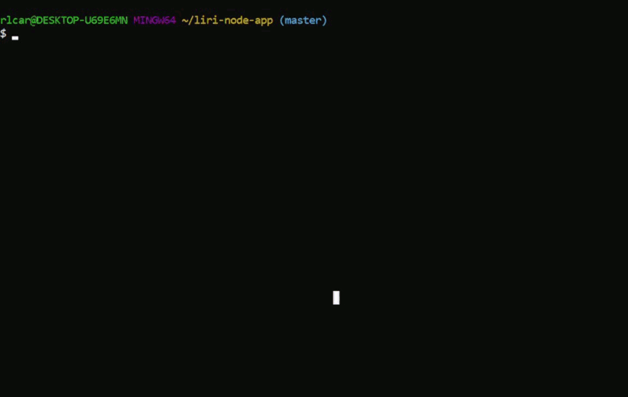

# LIRI Bot

## Overview
LIRI is a Node CLI application for fetching information about songs, concerts, and movies.

The application uses:
* Node-spotify-api Node package
* Axios Node Package
* OMDB API
* Bands in Town API
* Inquirer Node package

Results of each query are saved to a log file

### Spotify

Enter the command `node liri spotify-this-song <song name>`

### Bands in Town

Enter the command `node liri concert-this <band name>` for a list of upcoming concerts

### OMBD

Enter the command `node liri movie-this <movie name>` for details about a film

### Random

There in the `random.txt` file, there is a preformatted command that can be called with `node liri do-what-it-says`

### Guided input

If the application is called with no or invalid parameters, a prompt is displayed to guide the user or display the valid commands

